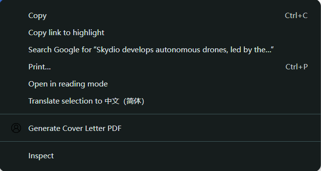

# Universal AI Cover Letter Generator

A Chrome extension that generates personalized cover letter PDFs from **any resume** and **any job posting**, using AI with automatic provider detection.

---

## Features

- **One API Key → multiple AI providers**  
  (OpenAI, Groq, OpenRouter, Anthropic, Gemini, DeepSeek, Together…)
- **Automatic provider detection** — no dropdowns or manual settings
- **Works on ALL websites** (uses `selectionText`, no content scripts)
- **Upload PDF/TXT resumes** (PDF.js-powered extraction)
- **AI resume parsing → structured data**
- **Right-click → generate cover letter PDF**
- **Professional formatting** (US Letter, margins, spacing)
- **Secure**: All data stored locally; API requests go directly to your provider

---

## How to Use

### 1. Upload Your Resume
Click the extension icon → paste resume text **or upload PDF/TXT** →  
Click **Parse & Save Resume**.

  

### 2. Generate a Cover Letter
1. Select job description text on any website  
2. Right-click → **Generate Cover Letter PDF**  
3. Your personalized PDF downloads automatically  

  

---

## Installation (Developer Mode)

1. Go to `chrome://extensions/`
2. Enable **Developer mode**
3. Click **Load unpacked**
4. Select the extension folder

---

## API Calls (Short Version)

The extension uses a **single API Key field** and automatically detects your provider based on key format.

Supported providers (auto-detected):

- **OpenAI** (`sk-...`)
- **OpenRouter** (`sk-or-...`)
- **Groq** (`gsk_...`)
- **Anthropic (Claude)** (`sk-ant-...`)
- **Google Gemini** (`AIza...`)
- **DeepSeek / Together / others** (fallback to OpenAI format)

> **Note:** This extension is primarily tested using OpenAI-compatible APIs.  
> Other providers should work but may behave differently.

No configuration required — just paste your API key.

---

## File Structure

